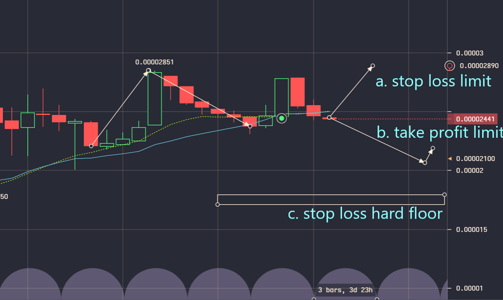
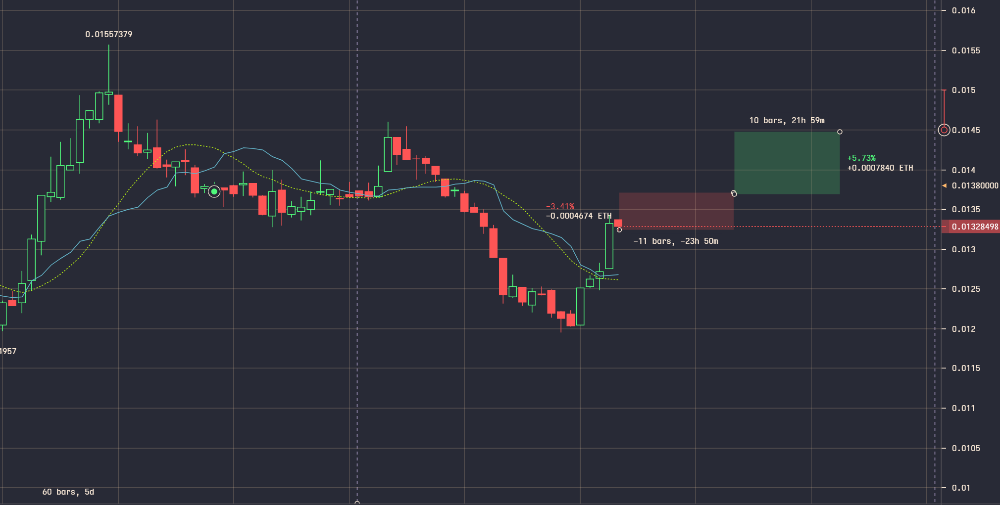
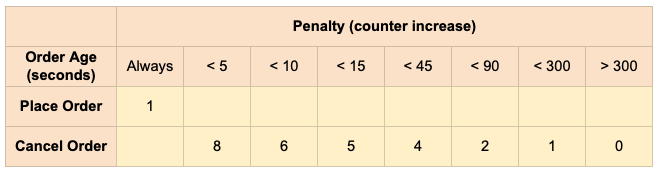
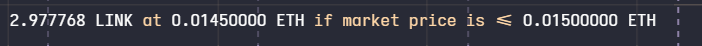
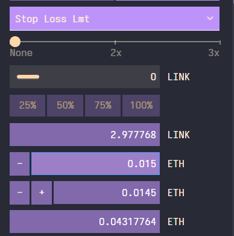
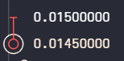

# A Programmer's Guide to Trading

<a name="todo"/>

#### *To Do*

- historical data collection
- choose covariates with elimination and weighted fitting over time
  - reference popular covariates used in stock market algorithms that are generalizable to multiple   currencies
  - reference history of stock market algorithms
- [fix stop loss limit definition](https://www.investopedia.com/articles/active-trading/091813/which-order-use-stoploss-or-stoplimit-orders.asp)

- [Maker and Taker Fee Schedules](https://support.kraken.com/hc/en-us/articles/360000526126-What-are-Maker-and-Taker-fees-)

- [How to Maintain a Valid Order Book](https://support.kraken.com/hc/en-us/articles/360027821131-How-to-maintain-a-valid-order-book-)

- [What is a Nonce Window](https://support.kraken.com/hc/en-us/articles/360001148023-What-is-a-nonce-window-)


- fallacies research [1](https://www.google.com/search?q=list+of+stock+market+fallacies&oq=list+of+stock+market+fallacies&aqs=chrome..69i57.3041j0j7&sourceid=chrome&ie=UTF-8)

- analysis guides [1](https://www.youtube.com/watch?v=eynxyoKgpng)


###### Alert Key

owned/spec/pending **|** buy/sell/eval **|** sub-dip, dip, rise, sub-rise


<a name="table-of-contents"/>

# Table of Contents


## [**Protocols**](#Protocols)

 - [***Strategy Log***](#strat-log)


## [Algorithms](#Algorithms)
 - [***Data Sources***](#Data-Sources)
   - [SRK](#SRK-Kaggle)

## [**Software**](#Software)

 - [***APIs***](#APIs)
   - [Kraken API](#Kraken-API)
     - [*List of Methods*](#methods-list)
     - [*API Keys*](#API-Keys)
     - [*Key Configuration*](#Key-Configuration)
     - [*Using API Key*](#Using-API-Key)
     - [*Trading Rate Limits*](#Trading-Rate-Limits)
       - [Penalty Chart](#Penalty-Chart)
       - [Max Rate Calculation](#Max-Rate-Calc)
 - [***Trading Bots***](#trading-bots)
 - [***Python Packages***](#Python-Packages)
   - [Crypto Currencies Stock (CSS)](#CSS)
 - [***Info Widgets***](#Info-Widgets)
   - [CLI Widgets](#CLI-info-widgets)


## [**Cryptocurrencies Wiki**](#Cryptocurrencies)
 - [***Blockchains***](#Blockchains)
 - [***Wallets***](#Wallets)
 - [***Nodes***](#Nodes)
 - [***Tokens***](#Tokens)
 - [***Privacy***](#Privacy)
 - [***Confirmations***](#Confirmations)
 - [***Blockchains***](#Summary)

 
## [**Trade Balance**](#Trade-Balance)
- [***Opening Cost***](#Opening-Cost)
- [***Current Valuation***](#Current-Valuation)
- [***Profit/Loss***](#Profit-Loss)
- [***Equity***](#Trade-Balance-Equity)


## [**Margin**](#Margin)
- [***Initial Margin***](#Initial-Margin)
- [***Free Margin***](#Free-Margin)
- [***Margin Cost***](#Margin-Cost)
- [***Margin Level***](#Margin-Level)
- [***Margin Call***](#Margin-Call)
  - [Margin Call Level](#Margin-Call-Level)
  - [Margin Liquidation Level](#Margin-Liquidation-Level)
  - [Calculate Margin Call](#Calculate-Margin-Call)
- [***Maintenance Margin***](#Maintenance-Margin)
- [**US Margin Obligation Term Limit**](#US-Limit)
- [**Closing On Margin**](#Closing-On-Margin)
  - [Settling On Position](#Setting-On-Position)
    - [*Settling On Spot Position*](#Setting-On-Spot-Position)
      - [*Order Type*](#Order-Type)
      - [*Leverage*](#Settling-Leverage)
      - [*Currency Pairs*](#Settling-Currency-Pari)
      - [*Volume*](#Settling-Volume)
      - [*Examples*](#Settling-Spot-Examples)
      - [*Settling via API*](#Settling-Via-API)
  - [Closing Transactions](#Closing-Transactions)
  - [Closing Leverage](#Closing-Leverage)
  - [Closing Amount](#Closing-Amount)
  - [Closing Examples](#Closing-Examples)
- [***Position***](#Margin-Position)
  - [Order Position vs. Trade Position](#Order-vs-Trade)
- [***Collateral Currency***](#Collateral-Currency)


## [**Orders**](#Orders)
- [***Conditions***](#Conditions)
  - [Limit](#Limit)
  - [Stop Loss](#Stop-Loss)
  - [Take Profit](#Take-Profit)
  - [Stop Loss Limit](#Stop-Loss-Limit)
  - [Take Profit Limit](#Take-Profit-Limit)
  - [Settle Position](#Settle-Position)
- [***Conditional Orders***](#Conditional-Orders)
  - [Fee Currency](#Fee-Currency)
  - [Expire Date](#Expire-Date)
  - [Post Limit Order](#Post-Limit-Order)
  - [Start](#Start)
  - [Leverage](#Leverage)
    - [*Used Margin*](#Leverage-Used-Margin)
    - [*Maximum Position Size*](#Leverage-Maximum-Position-Size)   
    - [*Maximum Leverage*](#Leverage-Maximum-Leverage)
    - [*Risk Management*](#Leverage-Risk-Management)
- [***Conditional Closes***](#Conditional-Closes)
  - [Closing On Margin](#Closing-On-Margin)


## [**Hedging**](#Hedging)
- [***Direct Hedging***](#Direct-Hedging)
- [***Indirect Hedging***](#Indirect-Hedging)


## [**Staking**](#Staking)
- [***Ethereum Staking***](#Ethereum-Staking)
   - [How to Stake ETH](#How-to-Stake-ETH)
   - [Overview of On-chain Staking](#On-chain-staking)
     - [*Benefits*](#staking-benefits)
     - [*Eligible Assets*](#staking-eligible-assets)
     - [*Balance Hold & Impact on Equity*](#balance-hold-and-impact-on-equity)
     - [*Rewards*](#staking-rewards)
     - [*Time*](#staking-time)
     - [*Fees*](#staking-fees)
     - [*Resources*](#staking-resources)
   - [Overview of Off-chain Staking](#Off-chain-staking)
     - [*Eligibility*](#Off-Eligibility)
     - [*Equity Impact*](#Equity-Impact-Off-Chain)
     - [*Rewards*](#Off-Rewards)
   - [How to Stake](#How-to-stake)
   - [How to Unstake](#How-to-unstake)
   - [Off-chain Staking Eligibility & Availability](#Off-chain-staking-eligibility)
   - [Proof-of-Stake Protocol](#Proof-of-Stake-protocol)

-----------------------------------------------------------

<a name="Protocols"/>

# Protocols

<a name="strat-log"/>

### Strategy Log

#### Day 1

###### Micro	
- stop profits -> get in get out in order to keep options open and retain liquiditiy 
- Catch rises on assets -> order STOP LOSS -> creates cash-out floor with only good outcomes (hold if continues to rise; sell if hit floor)
- cash in when index currencies are low value relative to USD
- cash in during maket rises, cash out during market dips
	
###### Macro	
- when to bandwagon?
- dont be gready. make money and don't lost money
	

#### Day 2

###### Micro	
- make limits idiosyncratic numbers to avoid bandwagon momentum and vice-versa -- depending on if going for mid-rise dip or dependingin on consistent run/inflection-point 	

*THREE CONDITONS*:

1. stop loss limit on condition of rise
2. take profit limit on dip
3. hard floor stop loss



###### Macro
 
DOES IT MAKE SENSE TO BASE DECISIONS OFF OF THE BUYING PRICE?		  
- the only real reason to use buy-in price in decision-making process is to ensure that you are making money
- there is no other reason that I can think of. 
- on the other hand, the stat can very easily bias your reasoning. it is probably pretty high on the ability-to-bias-thinking spectrum as far as individual stats/metrics go. 
- for those reasons, it makes sense to look for another metric that can gaurentee the same outcome and then ignore the buy-in metric altogether to avoid the incurred biases 

*Readnig Candlstick Graphs*: the period (e.g., 1d, 4h) is the widrth of the candlesticks on the candlesticks graph
use the 'cycle tools' drawing tool to illustrate other time periods/differentiations on top of the period candlestick spread

#### Day 3

###### Macro

- don't limit vision and observatino to owned/previously-owned assets.
- cash in -> buy value -> repeat
- placing special vslue on asset that has huge run in recent past = fallacy /narrative / irrational bias 

###### Micro

Ceiling -> Floor Limit for High Frequnecy Cash-Ins



--------


<a name="Algorithms"/>

# Algorithms


<a name="Data-Sources"/>


## Data Sources

Historical Data Tab on coinmarketcap.com (e.g., [for BTC](https://coinmarketcap.com/currencies/bitcoin/historical-data/?start=20130428&end=20171004))

[Coin Market Cap Data FAQ](https://coinmarketcap.com/faq/)

-----------------------------------

<a name="SRK-Kaggle"/>

#### (1) SRK | Kaggle | 2021-02-28

[Link](https://www.kaggle.com/sudalairajkumar/cryptocurrencypricehistory)


The dataset has one csv file for each currency. Price history is available on a daily basis from April 28, 2013. This dataset has the historical price information of some of the top crypto currencies by market capitalization.

Date : date of observation
Open : Opening price on the given day
High : Highest price on the given day
Low : Lowest price on the given day
Close : Closing price on the given day
Volume : Volume of transactions on the given day
Market Cap : Market capitalization in USD


---------------


<a name="Software"/>

# Software


<a name="APIs"/>

### APIs

 - Bifinex
 - Bitstamp
 - Bittrex
 - Btcc
 - Btccpro
 - Btccusd
 - Btce
 - Bter
 - Cexio
 - Okcoin
 - Poloniex
 - [CSS Ticker](https://cryptocurrenciesstocks.readthedocs.io/ticker.html)


<a name="Kraken-API"/>

#### Kraken API

[REST API docs](https://docs.kraken.com/rest/)

[More Detailed REST API methods documentation](https://cryptocurrenciesstocks.readthedocs.io/kraken.html)

[Websockets API docs](https://docs.kraken.com/websockets)

[Kraken Futures API docs](https://support.kraken.com/hc/en-us/categories/360001806372-Futures-API)

Further information and FAQs may be found on the [API section](https://support.kraken.com/hc/en-us/categories/360000080686-API) of the Kraken support pages.


<a name="methods-list"/>

##### List of Methods

[Params, Return Values, Explanation, Examples for Each Method](https://cryptocurrenciesstocks.readthedocs.io/kraken.html)

###### Public Methods

 - `Server Time`
 - `System Status`
 - `Asset Info`
 - `Tradeable Asset Pairs`
 - `Ticker Information`
 - `OHLC Data`
 - `Order Book`
 - `Recent Trades`
 - `Recent Spreads`

###### Authenticated Methods

*user data*

 - `Closed Orders`
 - `Orders Info`
 - `Trades History`
 - `Trades Info`
 - `Open Positions`
 - `Ledgers Info`
 - `Ledgers`
 - `Trade Volume`
 - `Export Report`
 - `Export Report Status`
 - `Retrieve Data Export`
 - `Delete Export Report`

*user trading*

 - `Add Order`
 - `Cancel Order`
 - `Cancel All Orders`
 - `Cancel All Orders After X`

*user funding*

 - `Deposit Methods`
 - `Deposit Addresses`
 - `Status of Recent Deposits`
 - `Withdrawal Information`
 - `Withdraw Funds`
 - `Get Status of Recent Winthdrawals`
 - `Request Withdrawal Cancellation`
 - `Request Wallet Transfer`


##### Authentification

Authenticated requests must include both `API-Key` and `API-Sign` HTTP headers, and `nonce` in the request payload. `otp` is also required in the payload if two-factor authentication (2FA) is enabled.


`nonce`

Nonce must be an always increasing, unsigned 64-bit integer, for each request that is made with a particular API key. While a simple counter would provide a valid nonce, a more usual method of generating a valid nonce is to use e.g. a UNIX timestamp in milliseconds.

Note: There is no way to reset the nonce for an API key to a lower value, so be sure to use a nonce generation method that won't produce numbers less than the previous nonce. Too many requests with invalid nonces (EAPI:Invalid nonce) can result in temporary bans. Problems can arise from requests arriving out of order due to API keys being shared across processes, or from system clock drift/recalibration. An optional "nonce window" can be configured to specify a tolerance between nonce values. Additional info can be found in our [support pages](https://support.kraken.com/hc/en-us/articles/360000906023-What-is-a-nonce-).


`otp`

If two-factor authentication (2FA) is enabled for the API key and action in question, the one time password must be specified in the payload's `otp` value.


###### Example Code

```python
import urllib.parse
import hashlib
import hmac
import base64

def get_kraken_signature(urlpath, data, secret):

    postdata = urllib.parse.urlencode(data)
    encoded = (str(data['nonce']) + postdata).encode()
    message = urlpath.encode() + hashlib.sha256(encoded).digest()

    mac = hmac.new(base64.b64decode(secret), message, hashlib.sha512)
    sigdigest = base64.b64encode(mac.digest())
    return sigdigest.decode()

api_sec = "kQH5HW/8p1uGOVjbgWA7FunAmGO8lsSUXNsu3eow76sz84Q18fWxnyRzBHCd3pd5nE9qa99HAZtuZuj6F1huXg=="

data = {
    "nonce": "1616492376594", 
    "ordertype": "limit", 
    "pair": "XBTUSD",
    "price": 37500, 
    "type": "buy",
    "volume": 1.25
}

signature = get_kraken_signature("/0/private/AddOrder", data, api_sec)
print("API-Sign: {}".format(signature))
```


<a name="API-Keys"/>

##### Kraken API Keys

 1. Click on your name in the upper-right corner of the page.
 2. `Security` --> `API` --> `Add key` 
 3. Congiure Settings (see below section)
 4. `Generate key`
 5. After scanning the QR code and/or saving the Public and Private keys, make sure to click "Save" or the key will not be valid
 6. The "Private Key" and QR code will only be visible once after first generating it! Please save it in a password manager if you need to access it again later. Do not save it in an unencrypted format!


<a name="Using-API-Key"/>

##### Using a Kraken API Key


1. The key pair can be copied and pasted as plain text directly into the API client code. Example: The method used by our [PHP API client](https://www.kraken.com/help/api#example-api-code-php).
2. The key pair can be copied and pasted into plain text files that the API client can access.
Example: The method used by our [command line API client](https://support.kraken.com/hc/en-us/sections/360003946512-REST-API-via-Command-Line).
3. The key pair values can be imported into our [mobile app](https://support.kraken.com/hc/en-us/articles/360001332083-Does-Kraken-have-a-mobile-app-) for iOS and Android by scanning the QR code (as shown above) with the mobile camera. There is a full guide [here](https://support.kraken.com/hc/en-us/articles/360035317352).


<a name="Key-Configuration"/>

##### Configuring Kraken API Keys

###### Key Description
The Key Description is essentially the name of the API key, and can be almost anything that you prefer, as long as the description is unique (different from the descriptions of any other API keys on the same account).

By default, the Key Description will be populated with something like "api-key-1605316109249". This default description can be kept or changed in favour of a more descriptive name (such as "Trading Key", "Account Management Key", "Python API Key 6", or "Mobile App Key", for example).

###### Key Permissions
The Key Permissions determine which private API methods the API key is allowed to use:

######  Query Funds 
is required for the account management methods that query the account balance information, such as Balance and TradeBalance.

###### Deposit Funds 
is required for the funding methods related to deposits, such as DepositMethods and DepositAddresses.

###### Withdraw Funds
is required for the funding methods related to withdrawals, such as WithdrawInfo, Withdraw, and WithdrawCancel.

###### Query Open Orders & Trades 
is required for the account management methods that query already existing orders and positions, such as OpenOrders, 
QueryOrders, and OpenPositions.

###### Query Closed Orders & Trades 
is required for the account management methods that query previous closed/cancelled orders and positions, such as ClosedOrders, QueryOrders, and QueryTrades.

###### Modify Orders 
is required for the trading method that places new orders, namely AddOrder.

###### Cancel/Close Orders 
is required for the trading method that cancels open (pending) orders, namely CancelOrder.

###### Query Ledger Entries 
is required for the account management methods that retrieve historical account data from the account ledger, namely Ledgers and QueryLedgers.

###### Export Data 
is required for the account management methods that export the account ledger, namely AddExport, RetrieveExport, ExportStatus, and RemoveExport.

###### Access WebSockets API 
is required to retrieve an authentication token for the WebSocket API private feeds/endpoints.

###### Nonce Window 
is a short time frame (1 second, 10 seconds, etc.) during which API requests with an invalid nonce, specifically a nonce value lower than a previously used nonce value, will not cause an invalid nonce error (EAPI:Invalid nonce). The main goal of the nonce window is to overcoming network inconsistencies.

###### Key Expiration 
is for creating an API key that only works for a user-specified amount of time.

###### Query Start/End Date/Time 
is for specifying a time frame for which historical account data can be queried using that particular API key.

###### Adding 2FA

API key 2FA can be added to an already existing API key via the Security page and can use either a static password or Google Authenticator.

Note: Adding 2FA to an API key also requires that the API client supports 2FA (provides the 2FA data for each call to the private API methods), otherwise an unexpected error would be returned instead of the desired API output.

Read more about how 2FA works for API keys [here](https://support.kraken.com/hc/en-us/articles/360000714526-How-does-two-factor-authentication-2FA-for-API-keys-work-).

-----------


<a name="Trading-Rate-Limits"/>

##### Kraken [Trading Rate Limits](https://support.kraken.com/hc/en-us/articles/360045239571)

###### Rate limit reached values

Based upon a counter that increases as orders are placed and cancelled, and decreases over time at a fixed decay rate.

- Starter / Express =  60
- Intermediate  =  125
- Pro  =  180

###### Decay Rate

- Starter / Express =  1 per second
- Intermediate  =  2.34 per second
- Pro  =  3.75 per second


<a name="Penalty-Chart"/>

###### Penalty Per Event




<a name="Max-Rate-Calc"/>

###### Maimum Rate Calculation


How to determine the maximum number of order events per minute without reaching the rate limits:

`Order penalty` = (`Penalty points` * `Fill rate`) + (`Penalty points` * `Fill rate`) ... (up to 100%)

`Order events / min` = `60s` / ( `Order penalty` / `Decay rate` )


As an example for a pro level account placing limit orders, 60% of which were filled after 3 seconds, and 40% of which were cancelled after 8 seconds:

`Order penalty` = ( `1` * `60%`) + (`7` * `40%`) = `3.4 points`

`Order events / min` = `60` / (`3.4` / `3.75`) = `66 events` 


*More*: [Chronological Example](https://support.kraken.com/hc/article_attachments/360060402751/Screenshot_2020-06-24_at_07.37.59.png)


--------------


<a name="trading-bots"/>

## Trading Bots

#### [Hodlbot](https://www.hodlbot.io/)


<a name="Python-Packages"/>

## Python Packages

<a name="CSS"/>

##### Crypto Currencies Stock (CSS)


[Docs](https://cryptocurrenciesstocks.readthedocs.io/index.html)


<a name="Info-Widgets"/>

## Info Widgets

- https://www.covemarkets.com/widgets/
- Cryptowatch


<a name="CLI-info-widgets"/>
 
###### CLI Info Widgets

**Cointop**

Colorschemes:
cointop
crimson
grayscale
homebrew
iceberg
mars
matrix
synthwave
system
xray

**Coinmon**


<a name="Cryptocurrencies"/>

# Cryptocurrencies Wiki

Cryptocurrencies are digital assets designed to facilitate peer-to-peer financial transactions and smart contracts on the internet in a decentralized manner. This was first accomplished by solving the “double spend” problem and by using advanced cryptography and programming.


Cryptocurrencies are a distributed financial ledger that is shared all over the world. The most famous examples of cryptocurrencies are Bitcoin (BTC) and Ethereum (ETH), but there are countless others.

[full list of cryptocurrencies available on Kraken](https://support.kraken.com/hc/en-us/articles/360000678446)


-----------------------------------------------------------

<a name="Blockchains"/>

### Blockchains


[The ultimate 3500-word guide in plain English to understand Blockchain](https://www.linkedin.com/pulse/blockchain-absolute-beginners-mohit-mamoria)

Cryptocurrencies record transactions on public ledgers known as “blockchains” and are the first form of digital money where an intermediary is not required to send funds from one person to another person.


-----------------------------------------------------------

<a name="Wallets"/>

### Wallets


Cryptocurrencies do not have a physical location; wallets do not hold cryptocurrencies. Wallets only hold the cryptographic keys needed to access one’s cryptocurrencies on the relevant blockchain.


##### Kraken is not a wallet service
Kraken is an [exchange service](https://support.kraken.com/hc/en-us/articles/360030651871-What-is-Kraken-com-), not a wallet service. We provide clients the ability to deposit funds to our corporate wallet for safekeeping while the funds are being exchanged or used for trading or [staking](https://support.kraken.com/hc/en-us/categories/360002119091-Staking-Funds), but we do not provide a personal wallet service.

As with most exchanges, funds sent to deposit addresses are moved to [cold storage](https://www.kraken.com/security/practices) and hot wallets. Withdrawals are handled by the hot wallet and not the deposit address; the sending address for withdrawals will be different than the deposit address.

1. **Deposits**: If you deposit to a Kraken address that is not listed on your deposit page, it will not be possible for us to return the funds. It is your responsibility to ensure that the address to which you are depositing is listed on your deposit page, and that you are sending the correct cryptocurrency to it.
2. **Airdrops, Forks, & ICOs**: You will not be able to receive [airdrops, potential or proposed forks, or ICO tokens on your Kraken account](https://support.kraken.com/hc/en-us/articles/115013895208-General-statement-on-forks-airdrops-and-addition-of-new-digital-assets-cryptocurrencies).
3. **Withdrawals & Fees**: Transaction fees for withdrawals are automatically set by our system and cannot be changed. While we do our best to include a fee so that transactions will be confirmed within a reasonable amount of time, we cannot guarantee it due to the unpredictable nature of blockchain congestion.
4. **Withdrawals & Smart Contracts**: Do not attempt to withdraw digital assets from Kraken if ownership of the sending address is relevant to the transaction. For example, if you're depositing into an Initial Coin Offering (ICO) address, Kraken's hot wallet will be the depositor and not your personal Kraken deposit address. You will not be able to receive those ICO tokens. 
5. **Withdrawals & Returns**: If you withdraw digital assets from Kraken to a third party that returns the withdrawal to the address from which it was sent, those assets will not be recoverable by Kraken. Please take the relevant steps to prevent your funds from being sent to addresses that are not listed on the deposit page of your account.
6. **Kraken-to-Kraken transfers**: You will not be able to send cryptocurrencies from one Kraken account to another.


##### What wallets are there?
While we do not recommend any particular wallets, [hardware wallets](https://www.youtube.com/watch?v=3zNVDIz6Snw) do a great job of balancing usability with security for most mainstream clients.

Ledger and Trezor are two of the most popular makers of hardware wallets. You can visit the websites below to learn more about these security devices.

[Ledger](https://www.ledger.com/)


[Trezor](https://trezor.io/)


-----------------------------------------------------------

<a name="Nodes"/>

### Nodes


Cryptocurrencies do not actually “move” anywhere when you send or receive them. They just change ownership on the respective blockchain, which is stored on nodes all over the world and secured using cryptography. Anyone with the right resources can set up and run a node.


-----------------------------------------------------------

<a name="Tokens"/>

### Tokens


Some cryptocurrencies – Augur, Gnosis, Melon, Tether – run on top of other blockchains and are often referred to as "tokens".


-----------------------------------------------------------

<a name="Privacy"/>

### Privacy


Due to blockchains being public, cryptocurrencies are only pseudo-anonymous. A common goal for many cryptocurrencies is to improve privacy for clients, though only some cryptocurrencies make this their main focus (Monero, Zcash).


-----------------------------------------------------------

<a name="Confirmations"/>

### Confirmations


Double spending can still occur under some rare circumstances, which is why we require a certain number of confirmations before crediting cryptocurrency deposits.


-----------------------------------------------------------

<a name="Resources"/>

### Resources


###### Beginner

- Bitcoin.org: What is Bitcoin?
- SciShow: How Cryptocurrencies Work
- Vox: How Bitcoin is like the internet in the 80s

###### Intermediate
- How Bitcoin Works Under the Hood

###### Advanced
- Khan Academy: Bitcoin

Related: [Intrdocution to Fiat Currencies](https://support.kraken.com/hc/en-us/articles/360000380726-Explanation-of-fiat-currency)

----------------------------------------------------------


<a name="Trade-Balance"/>

# Trade Balance

Trade balance is the combined total value of all collateral currencies in your account.

Trade balance is always expressed in terms of the quote currency for the selected currency pair. As a result, your trade balance will fluctuate with exchange rates between currencies.

For example:

If BTC/USD is the selected currency pair, the trade balance will be in USD.
If BTC/EUR is the selected currency pair, the trade balance will be in EUR.

<a name="Opening-Cost"/>

### Opening Cost

Opening cost is the sum of amounts paid to open all currently open positions.

If you open a short BTC/USD position for 3,000 USD and later open another short BTC/USD position for 2,000 USD, your opening cost is 5,000 USD.


<a name="Current-Valuation"/>


### Current Valuation

Current valuation is the sum of the current value of all [open positions](https://support.kraken.com/hc/en-us/articles/203250333-What-is-an-open-position-and-how-is-it-created-).

If you have one position with a current value of 2,500 USD and another with a current value of 2,100 USD, your current valuation is 4,600 USD.


<a name="Profit-Loss"/>

### Profit/Loss

Profit/Loss is the total "paper" (or unrealized) profit or loss for all open positions. It does not include trading fees.

For long positions, you have an unrealized profit if your opening cost is lower than the current valuation. On the other hand, you have an unrealized loss if your opening cost is higher than the current valuation.
For short positions, you have an unrealized profit if your opening cost is higher than the current valuation. On the other hand, you have an unrealized loss if your opening cost is lower than the current valuation.
The unrealized profit or loss does not affect your currency balances until the positions are closed. However, any unrealized loss will cause the same amount to be withheld from your Trade Balance. Withheld funds are unavailable for [withdrawal](https://support.kraken.com/hc/en-us/articles/360000381966) or trading. 


###### Example of Calculating Profit/Loss
Suppose you have two short positions open.

One has an opening cost of $3,000 and a current value of $2,500. This position has a paper profit of $500.

The other has an opening cost of $2,000 and a current value of $2,100. This position has a paper loss of $100.

Your total profit on the two positions is $400.


<a name="Trade-Balance-Equity"/>

### Equity

Equity is your account trade balance plus (or minus) paper profit (or loss).

###### Example

Suppose you begin with a 10,000 USD trade balance and open a BTC/USD position for 5,000 USD.

If this position later has a paper loss of 750 USD, your account equity will be 10,000 - 750 = 9,250 USD.


--------------------------------

<a name="Margin"/>

# Margin

The margin in your account is the amount of funds that are currently available to be used — **“[free margin](https://support.kraken.com/hc/en-us/articles/203325743-Free-Margin)”** — or the funds currently used by a position — **“used margin”**. Margin is not deducted from your balance, but once margin is tied to a position it is not available for opening other positions, spot trading or withdrawal.

All funds used to open the position come from Kraken’s margin pool. The used margin can be thought of as a form of collateral, set aside from your balance in case the position falls to the point of liquidation. However, keep in mind that your loss on the position can be larger than the used margin.

If you open a $5,000 long position in BTC/USD with 5:1 leverage, your used margin for the position is $1,000. But if you later close this position for [Profit/Loss](https://support.kraken.com/hc/en-us/articles/203325713-Profit-Loss) (P/L) -$2,000, you have lost $2,000 - twice as much as the margin.

The Kraken margin product has been designed to protect the integrity of the Kraken margin pools for the benefit of all Kraken clients. The goal behind building in self-executing triggers (liquidations) is to preserve the Kraken margin pools so that our assets remain available to all Kraken clients. Liquidations also serve as a mechanism to help avoid a situation in which clients are required to repay a negative balance with funds in excess of those currently in their Kraken accounts.

###### Margin vs. Equity
It is important to note that margin is not the same as [equity](https://support.kraken.com/hc/en-us/articles/203325723-Equity). Equity is the combined value of your collateral currencies and P/L, and margin level is your equity divided by used margin, expressed as a percentage.

###### Example Scenario
Suppose you currently hold 5,000 USD in your account balances. You have opened a long position with 5:1 leverage worth 15,000 USD. The used margin for this position is 3,000 USD since 15,000 divided by the leverage amount (5) is 3,000. Your account now has 2,000 USD remaining in free margin. This means you are capable of opening additional positions valued up to 10,000 USD using 5:1 leverage (the maximum leverage amount). Let’s assume the position has been open for a short time and has achieved 5% profit. To determine your margin level at this moment, the system performs the following calculations.

###### *Solving for Equity:*

`Equity = Trade Balance + Profit/Loss`
([Trade Balance](https://support.kraken.com/hc/en-us/articles/203325703-Trade-Balance) is your total collateral holdings, used and unused)

`Equity = 5,000 USD + (5%×15,000 USD)`


`Equity = 5,000 USD + 750` 

Therefore, `Equity = 5,750`


###### *Solving for Margin Level:*

[Margin Level](https://support.kraken.com/hc/en-us/articles/203325753-Margin-Level) = `(Equity ÷ Used Margin) × 100`

`Margin Level = (5,750 ÷ 3,000)×100`
`Margin Level = 1.916 ×100`

Therefore, `Margin Level ≅ 191.6%`

 

----------------------------------------

<a name="Initial-Margin"/>

### Used Margin (Initial Margin)


Used margin is the amount of your trade balance that is initially withheld when you open a spot position on margin. Unlike free margin, used margin does not count unrealized profits/losses.

Used margin will decrease when part or all of a spot position on margin is closed.

Used margin is calculated as the size or "Cost" (Avg Price x Open Volume) of an open spot position on margin divided by the level of leverage selected. 


| Leverage Level | Used Margin |
|:---:|:---:|
| 2x | 1/2 of the position size |
| 3x | 1/3 of the position size |
| 4x | 1/4 of the position size |
| 5x | 1/5 of the position size |


###### Example

If, for example, you buy 0.5 BTC for 5,000 USD (the price is 10,000 USD per BTC):

At 5X leverage, your used margin is 1,000 USD.
At 4X leverage, your used margin is 1,250 USD.
At 3X leverage, your used margin is 1,667 USD.
At 2X leverage, your used margin is 2,500 USD.
Assuming the same position size, it is better to choose the higher level of leverage because it leaves more free margin in the account and thus has a larger buffer from liquidation.

However, *if the position size is maximized based on the leverage selected, then a higher leverage would be more risky*.

----------------------------------------

<a name="Free-Margin"/>

### Free Margin


Free margin is the amount of your trade balance that is available for [opening new spot positions on margin](https://support.kraken.com/hc/en-us/articles/203250333-What-is-an-open-position-and-how-is-it-created-).

Free margin is calculated as equity minus used margin.

For example,

With equity of 8,750 USD, and
used margin of 2,500 USD,
free margin would be 8,750 - 2,500 = 6,250 USD.

###### *Note*

If you try to open a spot position on margin for which you do not have sufficient free margin, the order will be automatically cancelled (with the message "Insufficient initial margin").


----------------------------------------

<a name="Margin-Cost"/>

### Margin Cost


The margin cost for a position is the amount of margin tied to the position.

The amount of margin tied to the position is usually the initial margin.

However, the amount tied to the position can change with conversion rates between currencies or it can decrease if part of the position is closed.


----------------------------------------

<a name="Margin-Level"/>

### Margin Level


###### What Is Margin Level
Margin level is the percent ratio of your account equity to used margin. It helps you calculate how much money you have available for margin trading. The higher your margin level, the more cash you have on hand to trade.

If your margin level drops below 100%, you may not open new spot positions on margin until your margin level is back over 100%. If your margin level drops to 80% or lower, your positions may be forcibly closed, or “liquidated” (see "Margin Call Level" and "Margin Liquidation Level"). It is your responsibility as a trader to proactively monitor your margin level.

###### What Is Equity?
This is the sum of your collateral holdings (or “trade balance”) plus/minus any paper profit or loss on open positions.

###### How Is Margin Level Calculated?
Margin level is calculated as:

Margin level = (equity ÷ used margin)×100

###### Example
If your account equity is $8,000 and your used margin is $2,000 then your margin level is 400%. Margin level is very important because it tracks your margin trading potential and the overall status of your open spot positions on margin. If it falls to 100% you will not be able to open new positions, and if it falls more, some of your spot positions on margin may be automatically closed. If your margin level is getting close to 100%, you can raise it, either by adding collateral funds to your account to increase equity or by closing some open spot positions on margin to reduce used margin.

----------------------------------------

<a name="Margin-Call"/>

### Margin Call


<a name="Margin-Call-Level"/>

##### Margin Call Level


The "margin call level" is the margin level at which you are in danger of having some of your positions forcibly closed (or "liquidated").The margin call level is approximately 80%, although the exact threshold varies in accordance with price volatility in applicable markets.

When your margin level reaches the margin call level, you may receive a notification prompting you to either close some of your positions or deposit more collateral funds. Margin call level notifications are generally sent by email. However, margin call level notifications are not guaranteed. As such, it is important to proactively monitor your margin level.

If your margin level falls below the margin call level, you authorize us to liquidate either all of your open positions, or only enough to get your margin level above 100%, at our reasonable discretion. Positions will be liquidated in the order [First In, First Out](https://support.kraken.com/hc/en-us/articles/206141657-Closing-or-Settling-Multiple-Positions) (FIFO) regardless of currency pair or whether the position is in profit. Execution order may vary depending on the market conditions at the time.

###### Note: Liquidations can also happen due to our [margin obligation term limits](https://support.kraken.com/hc/en-us/articles/360000848703-Margin-financing-term-limits)


<a name="Margin-Liquidation-Level"/>

##### Margin Liquidation Level


The “margin liquidation level” is the [margin level](https://support.kraken.com/hc/en-us/articles/203325753-Margin-Level) at which an automated liquidation process will occur. The margin liquidation level is approximately 40%, although the exact threshold varies in accordance with the price volatility in applicable markets.

Note: The liquidation process that initiates when your margin level falls below the margin liquidation level is automated, which means that once the process has started, it is not possible to stop it. 


<a name="Calculate-Margin-Call"/>

##### Calculate Margin Call PRice

You can use a series of linear equations to estimate how much the price of an asset would need to fall for your margin level to drop to 80% (the “margin call price”)..

For example, assume you've just entered into a “long” BTC spot position on margin by purchasing 1 BTC with 5:1 leverage at a price of 20,000 USD. You can estimate the approximate margin call price of your purchased BTC as follows. 

Assume that, after purchasing the 1 BTC, your Kraken account metrics are :

Trade Balance - 10,000 USD (assume your collateral balances are 100% composed of USD)

Used Margin - 4,000 USD

Opening Cost - 20,000 USD

Current Margin Level - 250%

 
We start by calculating what your equity would have to be for your margin level to fall to 80 %:

 Since:Margin Level = Equity / Used Margin

Then:

Margin Level * Used Margin = Equity

So:

80% * 4,000 USD = 3,200 USD

 

Using the calculated equity amount (in this example, 3,200 USD), we can estimate the aggregate amount the BTC you purchased would need to decrease in value to trigger a margin call.

 Since:

Equity = Trade Balance + Profit/Loss

Then:

Equity - Trade Balance = Profit/Loss

So:

3,200 USD - 10,000 USD = -6,800 USD

 

Now with the calculated Profit/Loss (in this example, -6,800 USD), we can approximate a “current valuation” for your spot position on margin. Keep in mind this calculation depends on if you are  “long” or “short” a given asset.

For a “long” spot position on margin, calculate:

Since:

Profit/Loss = Current Valuation - Opening Cost

Then:

Profit/Loss + Opening Cost = Current Valuation

So:

-6,800 USD + 20,000 USD = 13,200 USD

 

For a “short” spot position on margin, calculate:

Since:

Profit/Loss = Opening Cost - Current Valuation

Then:

Opening Cost - Profit/Loss = Current Valuation

 

With the current valuation (in this example, 13,200 USD) we can estimate the BTC margin call price.

Since:

Current Valuation = Price * Volume

Then:

Current Valuation/ Volume = Price

So:

13,200 USD / 1 = 13,200 USD

 

So (assuming your collateral balances are 100% composed of USD), for your margin level to drop to 80%, the price of BTC would have to fall to approximately 13,200 USD. You can use the equations above to estimate what the price of BTC would have to be for your margin level to fall to the margin liquidation level of 40% as well.

 

###### *Note* 

A caveat of using the above equations to calculate a margin call price is that they assume your collateral balances are 100% composed of USD. If you are using digital assets (e.g., BTC or ETH) as collateral, the USD value of your collateral would go down as the price of that digital asset goes down, causing the margin call price to actually be higher than the above calculations would suggest. For a more accurate margin call price approximation, you would need to re-calculate the price at separate intervals in time. By the same logic, if the price of your collateral currency increases, your margin call price may decrease, since the value of your collateral would be higher.

--------------------------

<a name="Maintenance-Margin"/>

### Maintenance Margin


Maintenance margin is the amount of account equity required to avoid a margin call. If your equity falls below the maintenance margin, your positions will be liquidated in order to pay back the Kraken Margin Pool assets that you used to open your spot position on margin. 

When your margin level is 100% your trade balance is fully leveraged. You will not be able to open new spot positions on margin.

When your margin level is between ~40-80%, liquidation is at Kraken’s discretion and all or a portion of your account may be liquidated; you may receive, but are not guaranteed, a margin call email.

When your margin level reaches ~40% or lower, liquidation is certain. The liquidation process is automatic, and once initiated cannot be stopped. 

By agreeing to our Terms of Service, you authorize and instruct Kraken to liquidate your funds in the conditions and manner described above. 

See also: [Margin Call Level and Margin Liquidation Level](https://support.kraken.com/hc/en-us/articles/203325763-Margin-Call-Level-and-Margin-Liquidation-Level)


<a name="US-Limit"/>

### US Margin Obligation Term Limit


Clients who are located in-, are residents of-, or nationals of the United States (US) or its territories are limited to a 28-day maximum term for maintaining each open spot position on margin. 


You are expected to keep track of your open spot positions on margin and fully settle or otherwise close each position within 28 days of opening. If you do not settle or otherwise close a spot position on margin within 28 days of opening the position, you authorize and instruct us to sell or liquidate assets in your account in order to close the position on your behalf.
 
 
The message that appears on the order details of a time-limit liquidated position is "Time limit exceeded".


<a name="Closing-On-Margin"/>

### Closing or settling multiple spot positions on margin (FIFO)


###### Closing multiple open spot positions on margin

When trading using margin, you agree to close your open positions on a “First in First Out” (FIFO) basis. This means that if you have multiple positions open in the same currency pair, the position opened first will be closed first. Suppose you opened two “long BTC” positions, by purchasing 1 BTC on margin each time. If you then enter into a closing transaction to sell 1 BTC, the long BTC position that will be closed will be the one that was opened first.

If you use the closing order tool (shown below) at the bottom of your open positions list, the different volume settings will have the following results:

- 100% volume: creates a limit order that, if filled, will close all your open positions. It doesn't matter what level of leverage you select for this closing order.
- 50% volume: creates a limit order that, if filled, will close 50% of your open positions by volume, starting with your oldest positions. It doesn't matter what level of leverage you select for this closing order. 
- 25% volume: creates a limit order that, if filled, will close 25% of your open positions by volume, starting with your oldest positions. It doesn't matter what level of leverage you select for this closing order.
- 200% volume: creates a limit order that, if filled, will close all your open positions and create an opposing position of the same volume (i.e. close a 1 BTC long position and open a 1 BTC short position). The leverage level does matter for this order, since the newly opened position will use leverage at the level selected in the order. This is also referred to as “flipping” a position.  

*Note that you can enter a different volume amount or select a different order type in the order form if you want to do something different from the four options above.*

###### Settling multiple open spot positions on margin

The FIFO rule also applies to positions you close through settlement. This means that if you have multiple positions open in the same currency pair, the position opened first will be settled first. Suppose you opened two “long BTC” positions, by purchasing 1 BTC on margin each time. If you then do a Buy Settle Position order for 1 BTC, the long BTC position that will be settled will be the one that was opened first.

If you use the settle order tool (shown below) at the bottom of your open positions list, the different volume settings will have the following results:

- 100% volume: creates a settle order that will settle all your open positions. It doesn't matter what level of leverage you select for this settle order.
- 50% volume: creates a settle order that will settle 50% of your open positions by volume, starting with your oldest positions. It doesn't matter what level of leverage you select for this closing order. 
- 25% volume: creates a settle order that will settle 25% of your open positions by volume, starting with your oldest positions. It doesn't matter what level of leverage you select for this closing order.
- 200% volume: you can’t settle more than 100% of your open positions, so this will create an order that will settle all your open positions (the remaining volume of the order will be canceled). It doesn't matter what level of leverage you select for this settle order.

*Note that you can enter a different volume amount for the order if you wish.*

<a name="Setting-On-Position"/>

##### Settling a Position on Margin

By opening a spot position on margin, you incur corresponding obligations, including the obligation to return the amount of the margin extension to Kraken within a specific period of time, through position settlement and one or more closing transactions.

###### How settling a position works
You may close all or part of a spot position on margin by transferring to us, directly from your account balance with no trade involved, funds of the type used by Kraken to make the initial margin extension (e.g., if you took an extension of margin from Kraken denominated in BTC, you must have sufficient BTC in your account to settle the position). Upon settling, you retain the asset that you originally received from the market at the time of the position’s opening clear of any restrictions previously associated with your margin obligation. There are no trading fees associated with entering into a settlement transaction. If your account balance is not sufficient to enter into a settlement transaction, you may deposit additional funds into your account.  If you have sufficient funds in your account, but they are not of the type used by Kraken to make the initial margin extension, you may execute an order for the type and amount of funds you need to settle the position (e.g., buy 1 BTC of BTC/USD).

*Note: If you have multiple positions, they will be settled in the order they were created following the "First in First Out" (FIFO) rule.*

###### Examples

1. To settle an open **short BTC** BTC/EUR spot position on margin, you must transfer to Kraken the amount of BTC you sold on the market for EUR when you opened the position. This satisfies your obligation to return to Kraken the BTC that Kraken extended to you when you opened the position (i.e., sold the BTC for EUR).  
2. To settle an open **long BTC** BTC/EUR spot position on margin, you must transfer to Kraken the amount of EUR you used to purchase BTC on the market when you opened the position. This satisfies your obligation to return to Kraken the EUR that Kraken extended to you when you opened the position (i.e., used the EUR to buy BTC). 


<a name="Setting-On-Spot-Position"/>


##### How to settle a spot position on margin

Position settlement may only be initiated via the Advanced order form from the New Order page, or through the [API](https://www.kraken.com/features/api#add-standard-order).

<a name="Order-Type"/>

###### Order Type
Position settlement may only be initiated via the through a specific order type. The "Settle Position" order type is only found on the Advanced order tab from the New Order page. Make sure it is selected.

###### Pro Tip:
- To settle a long spot position on margin, use a buy/settle order type.
- To settle a short spot position on margin, use a sell/settle order type.


<a name="Settling-Leverage"/>

###### Leverage
Selecting a level of leverage is necessary (e.g, minimum 2x) in order to initiate an order for position settlement. However, the level of leverage selected does not need to match the leverage level you used to open the position. This is because, other than indicating to Kraken’s system that the order you are placing is for position settlement, the leverage selected is irrelevant in a settlement transaction.

<a name="Settling-Currency-Pari"/>

###### Currency pair
The position settlement order must be in the same currency pair as the order that opened the spot position on margin.

<a name="Settling-Volume"/>

###### Volume
Specify how much volume you want to settle. You may settle a portion of an open spot position on margin if desired.

<a name="Settling-Spot-Examples"/>

###### Long Example
Suppose you buy 1 BTC of BTC/EUR at 2x1 leverage (going “long” BTC).
To settle the entire position, you buy/settle 1 BTC and select the BTC/EUR trading pair (at any leverage - the specific level of leverage selected is irrelevant).
To settle half the position, you buy/settle 0.5 BTC and select the BTC/EUR trading pair (at any leverage - the specific level of leverage selected is irrelevant).


###### Long Example
Suppose you sell 1 BTC of BTC/EUR at 2x1 leverage (going "short" BTC):
To settle the entire position, you sell/settle 1 BTC and select the BTC/EUR trading pair (at any leverage - the specific level of leverage selected is irrelevant).
To settle half the position, you sell/settle 0.5 BTC and select the BTC/EUR trading pair (at any leverage - the specific level of leverage selected is irrelevant).

<a name="Settling-Via-API"/>

###### Settling via API
"Settle Position" orders work as described in our API documentation under the private user endpoint 'Add Standard Order' (AddOrder) with the "order type" as “settle-position”.

See the entire [API documentation](https://www.kraken.com/en-us/help/api#private-user-trading).


<a name="Closing-Transactions"/>


##### How closing transactions work
Through a closing transaction, you may partially or fully close a spot position on margin by executing an opposing order for up to the same volume as the order that opened your position (a sell closes a “long” spot position on margin and a buy closes a “short” spot position on margin). The proceeds from a closing transaction are applied first to the satisfaction of your margin obligation to Kraken. Then, any remaining profit (or loss) is added to (or taken from) your account balances, in an amount denominated in the [quote currency](https://support.kraken.com/hc/en-us/articles/227876608) of the pair you are trading (e.g., EUR in the pair BTC/EUR).  

If you do not have enough funds in your account denominated in the quote currency of the pair you are trading to cover any remaining loss, funds in your account will be converted, as necessary, into funds denominated in the quote currency of the pair you are trading, subject to a fee (a 1.5% fee for a fiat-to-fiat conversion, 2.5% fee for a conversion of BTC or ETH to or from fiat, and a 5% fee for all other conversions). As a result, you may want to execute an order for the type and amount of funds you need before entering into a closing transaction so that your closing transaction does not result in a conversion fee.

*Note: If you have multiple positions, they will be closed in the order they were created following the "First In, First Out" (FIFO) rule.*

#####  How to enter a closing transaction 
Just like an order to open a spot position on margin, a closing transaction order needs to use the Intermediate or Advanced order form from the New Order page. As described in more detail below, you must select a level of leverage for the order to instruct the system that you intend to enter into a closing transaction.

<a name="Closing-Leverage"/>


##### Leverage
Selecting a level of leverage is necessary (e.g., minimum 2x) in order to initiate an order for a closing transaction. However, the level of leverage selected does not need to match the leverage level you used to open the position. This is because, other than indicating to Kraken’s system that the order you are placing is for a closing transaction, the level of leverage selected is irrelevant in a closing transaction.  

##### Currency pair
The closing transaction order must be in the same currency pair as the order that opened the spot position on margin.


<a name="Closing-Amount"/>

##### Amount
To completely close an open spot position on margin, enter the same Amount as the opening order. If you execute a closing transaction order for more volume than your spot position on margin, you will effectively create a new spot position on margin on the opposite side (this is called “flipping” the position).


###### Flipping a spot position on margin

You can easily flip your exposure to a currency from “long” to “short,” or “short” to “long.” To do this, simply execute an opposing order using margin with more volume than your existing open position(s).

Suppose you have two “short BTC” positions open, at 1 BTC volume each, but you want to close these positions and go “long BTC,” at 1 BTC volume, on 3x leverage. You can do this by buying 3 BTC using margin, with 3x leverage.


###### 'Zero trick' for amount
To close the full volume of all open positions for a specific pair, you can place '0' as the amount of a closing transaction order. This can be useful to close all open spot positions on margin for a specific pair with one order, or to close small remaining volumes of open spot positions on margin. 


<a name="Closing-Examples"/>

###### Long Example
Suppose you buy 1 BTC of BTC/EUR at 2x leverage (going “long” BTC):
To close the entire position, you need to sell 1 BTC of BTC/EUR in a closing transaction (at any leverage - the specific level of leverage selected is irrelevant).
To close half the position, you need to sell 0.5 BTC of BTC/EUR in a closing transaction (at any leverage - the specific level of leverage selected is irrelevant).
To flip the position by 100%, you need to sell 2 BTC of BTC/EUR in an opposing spot transaction on margin (at any leverage - the leverage amount will apply to the new position and determine the collateral withheld).


###### Short Example
Suppose you sell 1 BTC of BTC/EUR at 2x leverage (going “short” BTC):
To close the entire position, you need to buy 1 BTC of BTC/EUR in a closing transaction (at any leverage - the specific level of leverage selected is irrelevant).
To close half the position, you need to buy 0.5 BTC of BTC/EUR in a closing transaction (at any leverage - the specific level of leverage selected is irrelevant).
To flip the position by 100%, you need to buy 2 BTC of BTC/EUR in an opposing spot transaction on margin (at any leverage - the leverage amount will apply to the new position and determine the collateral withheld).
 


<a name="Margin-Position"/>

-------------------------------------------


### Position

By using an extension of margin from Kraken, you incur corresponding obligations and agree to comply with certain conditions until those obligations are satisfied. We refer to those circumstances where you have entered into a spot transaction on margin, but not yet satisfied these corresponding obligations, as an “open position.” 

Once a position is open, the amount of [funds used as collateral are not available for trading or withdrawal until the position is closed](https://support.kraken.com/hc/en-us/articles/360001385146-Margin-withholding-updates-September-2018-). As a result, when you enter into spot purchases or sales of cryptocurrency using margin on Kraken, the assets you receive from the market are reflected in your “positions” tab, which is separate from your “balances” tab. See [“Differences in spot trading with and without the use of margin.”](https://support.kraken.com/hc/en-us/articles/203325683-Differences-between-spot-exchange-and-margin-trading) 

Although reflected in this separate, “positions” tab, when you use margin on Kraken you are using an extension of margin to make an actual spot purchase or sale of cryptocurrency to a counterparty on the Kraken spot market exchange. You own and control the assets you receive in these margined spot transactions and can withdraw them from your Kraken account at any time subject only to the restrictions set forth in our Terms of Service.


<a name="Order-vs-Trade"/>

##### Order Position vs. Trade Position

A single margin order can create multiple trade positions depending on how many trades are used to fill the order.

The order position consolidates all the trade positions under a single position so it's easier to see the net result of the margin order.

Order positions can be seen under Trade > Positions page in your account. All order positions begin with "O".

Trade positions can be seen by clicking on the order position's ID and then navigating to the trade positions tab. 

-------------------------------------------

<a name="Collateral-Currency"/>

### Collateral Currency

A collateral currency is a currency that can be used as "collateral" for  trading using margin.

The collateral currency you hold does not have to match the trading pair of the order book on which you plan to trade using margin. This is possible because when you open a position by purchasing or selling cryptocurrency on margin (going “long” or “short”), Kraken’s own funds are used to extend margin to you for the full amount of that purchase or sale.

[collateral currencies on Kraken](https://support.kraken.com/hc/en-us/articles/204585998-Collateral-currency)


-------------------------------------------


<a name="Orders"/>

# Orders


<a name="Conditions"/>

### Conditions 


<a name="Limit"/>

##### *Limit*

- `+/-` relative to mp
- `=` fp


<a name="Stop-Loss"/>

##### *Stop Loss*

Buy/Sell at market once last price is `>=` stop price


<a name="Take-Profit"/>

##### *Take Profit*

Buy/Sell at market once last price `<=` take profit price


<a name="Stop-Loss-Limit"/>

##### *Stop Loss Limit*

Buy/Sell at fp once last price `>=` stop price


<a name="Take-Profit-Limit"/>

##### *Take Profit Limit*

Buy/Sell at a fp once mp `<=` take profit price


<a name="Settle-Position"/>

##### *Settle Position*

Settle position(s) at the original order price


----------------------------------------------------------


<a name="Conditional-Orders"/>

### Conditional Orders









<a name="Fee-Currency"/>

##### *Fee Currency*

Preferred currency to apply fees to


<a name="Expire-Date"/>

##### *Expire Date*

When the order should be cancelled (if not filled)

 - cancel on `day | week | month | hour | minute`
 - good during this `day | week | month`
 - good until cancelled


<a name="Post-Limit-Order"/>

##### *Post Limit Order*

The order will get posted on the books (or be cancelled). This prevents placing a limit buy order that matches against the sell side of the order book (and vice versa for sell orders) which would result in taker fees.


<a name="Start"/>

##### *Start*

When this order should be placed on the market

`day | week | month | hour | minute`


<a name="Leverage"/>

##### *Leverage*

[1](https://support.kraken.com/hc/en-us/articles/203053116-How-leverage-works-in-spot-transactions-on-margin)

Spot transactions on margin allow you to make spot purchases and sales of cryptocurrencies, on the Kraken exchange, using funds that exceed the balance of your account. Leverage, in this context, determines two things:

 1. Your **used margin** following an extension of margin.
 2. The **maximum amount** of margin Kraken will extend to you for a spot transaction on margin (your maximum “position size”).


<a name="Leverage-Used-Margin"/>

###### Used Margin


Used margin is the amount of your [collateral balances](https://support.kraken.com/hc/en-us/articles/204585998-Collateral-currency) that is [withheld](https://support.kraken.com/hc/en-us/articles/360001385146) in order to enter a spot transaction on margin. Used margin is calculated as the size (or "cost basis") of the margin extension provided to you divided by the level of leverage selected.

Let's say you purchase 5,000 USD worth of BTC on the BTC/USD order book using an extension of margin. 

With 5x leverage, only one-fifth of the position size, or 1,000 USD worth, will be withheld from your [collateral balance](https://support.kraken.com/hc/en-us/articles/204585998-Collateral-Currency) upon purchase of the BTC. 

With 2x leverage, half of the position size, or 2,500 USD worth, will be withheld from your collateral balance upon purchase of the BTC.

[Without any leverage](https://support.kraken.com/hc/en-us/articles/203325683-Differences-between-Spot-Exchange-and-Margin-Trading), you would need a 5,000 USD balance to make this purchase, and this balance would be exchanged directly for the equivalent amount purchased in BTC. 


<a name="Leverage-Maximum-Position-Size"/>

###### Maximum Position Size


The possibility of larger profits along with the risk of larger losses (and [liquidation](https://support.kraken.com/hc/en-us/articles/203325763-Margin-Call-Level-and-Margin-Liquidation-Level)) is determined by the size of your open positions relative to your collateral balance and not merely by the level of leverage you select.

When placing a margin trade, position size is selected separately from the leverage level. Selecting 5x leverage does not mean that your position size is automatically 5x bigger. It just means that you can specify a position size up to 5x your collateral balances.

 

###### *How much leverage should be used?*


Assuming the same position size, a higher level of leverage  leaves more [free margin](https://support.kraken.com/hc/en-us/articles/203325743-Free-Margin) in the account and thus has a larger buffer from liquidation.

However, if the position size is maximized based on the leverage selected, then a higher leverage level would be more risky.


<a name="Leverage-Maximum-Leverage"/>
 
###### Maximum Leverage


Kraken currently offers up to 5x leverage. The maximum level of leverage you can use [depends on the  currency pair](https://support.kraken.com/hc/en-us/articles/227876608-Which-currency-pairs-can-I-trade-on-margin-) you're trading.


<a name="Leverage-Risk-Management"/> 

###### Risk Management


Spot transactions on margin involve a high degree of risk and are not suitable for everybody. Before using leverage, please take time to fully understand it and the risks involved. Among other things, using margin to support spot purchases and sales of cryptocurrencies can amplify your gains as well as your losses, and can even rapidly [wipe out your account](https://support.kraken.com/hc/en-us/articles/203325763-Margin-Call-Level-and-Margin-Liquidation-Level) if you aren't careful or the market moves against you. Sensible risk management should be employed when trading on margin. For example, you should consider setting both a stop loss and a profit target for every open position.  There are a lot of concepts to learn, but this is your money at stake, so it's worth your time to walk through everything carefully.


----------------------------------------------------------


<a name="Conditional-Close"/>

### Conditional Close

--------------------------------

<a name="Hedging"/>

# Hedging


Hedging is an attempt to mitigate the risk of an investment by investing in an opposing one.

In this way, it can be thought of as a type of insurance. When you "hedge positions", you’re attempting to open both “long” and “short” spot positions on margin in the same order book.


<a name="Direct-Hedging"/>

### Direct Hedging

You cannot have both long and short positions on margin open at the same time in a single currency pair. All long spot positions on margin must be closed before a short spot position on margin can be opened (and vice versa). See [Flipping Positions](https://support.kraken.com/hc/en-us/articles/206141667).

However, you can have multiple long spot positions on margin or multiple short spot positions on margin.


<a name="Indirect-Hedging"/>

### Indirect Hedging

It is possible to hold spot positions on margin in different directions for the same asset, so long as the positions are opened on different order books.

For example, you could be “long BTC” on the BTC/USD order book by purchasing BTC for USD using margin while simultaneously being “short BTC” on the BTC/EUR order book by selling BTC for EUR using margin.


--------------------------------

<a name="Staking"/>

# Staking


--------------------------------

<a name="Ethereum-Staking"/>

### Ethereum Staking


##### Ethereum (ETH) staking & the Ethereum 2.0 network upgrade & Proof-of-stake 

Ethereum 2.0, or Eth2, is an upgrade to the Ethereum network. By migrating Ethereum from the current proof-of-work network to a new proof-of-stake blockchain, Eth2 aims to increase scalability and reduce energy consumption. 

As a [proof-of-stake](https://support.kraken.com/hc/en-us/articles/360044443852) blockchain, the Eth2 Beacon Chain is built and secured by the network's validators. To participate as a Beacon Chain validator, you must stake ETH by sending it to a deposit contract on the Ethereum network. 

Understand that, unlike regular proof-of-stake protocol, staked ETH and ETH staking rewards will be locked until the Ethereum 2.0 network upgrade is complete. This transition is expected to evolve over multiple “phases” and may take several years to complete, or may never be completed. Kraken has no control whatsoever over this process. In the event the Eth2 network upgrade is delayed or cannot be completed, you may be unable to access, withdraw, or transfer your assets on-chain indefinitely.
 

##### Staking ETH to support the Eth2 Beacon Chain and earn Rewards

When you stake through Kraken, we will credit your account with staked ETH and the applicable staking rewards consistent with our Terms and the rules of the Ethereum network. These rewards are visible in the Staking page underneath the Total rewards column.

 

##### Reward rates are currently estimated between 5% and 7% annually (RPY), but rewards will vary according to the rules of the Ethereum protocol.

Kraken retains an administrative fee of 15% on all rewards received, and the estimated RPY reflects this fee. The reward rate provided by the Ethereum network is expected to vary depending on a variety of factors.

As described below, your user dashboard will assign different ticker symbols to the ETH in your account to designate its status within the Ethereum ecosystem (i.e., un-staked ETH, staked ETH, and ETH earned as staking rewards).

The Ethereum 2.0 network imposes an activation period on new validator nodes, which may cause a delay in distributing ETH staking rewards. To ensure staking rewards are distributed fairly, newly staked ETH will undergo an up to 12 hour bonding period before it will start earning ETH2 rewards. After the bonding period has elapsed, staking rewards will begin to accrue.

 

##### What is the meaning of the ETH, ETH2.S and ETH2 ticker symbols on Kraken?

###### ETH

The ETH ticker on Kraken represents “regular” ETH:  ETH on the Ethereum blockchain that has neither been staked nor earned as staking rewards. It can be staked, deposited, traded and withdrawn.

###### ETH2.S

The ETH2.S ticker on Kraken represents ETH that has been staked to support the Eth2 network upgrade. Clients that are not located in or citizens or residents of the US or Canada may transact on Kraken’s ETH2.S/ETH market when that market is made available. Otherwise, ETH2.S cannot be un-staked, deposited, or withdrawn. 

###### ETH2

The ETH2 ticker on Kraken represents ETH that is earned as staking rewards through Eth2 staking. ETH2 cannot be staked, deposited, traded or withdrawn.

 

##### What is the ETH2.S/ETH market on Kraken? 

Kraken’s ETH2.S/ETH market allows eligible clients to buy into (and sell out of) staking positions on the Ethereum network. It functions in the same manner as any other order book on Kraken, except that instead of trading one asset for another, on the ETH2.S/ETH market clients trade un-staked ETH for staked ETH. The differential between the two types of ETH can be expected to reflect a discount on ETH that is staked and locked in the Ethereum protocol generating staking rewards versus ETH that is not staked and freely transferable. 

 

##### Two important caveats about the ETH2.S/ETH market: 

1. The market will NOT be available for users located in or residents or citizens of the US and Canada (these clients can stake ETH, but not trade their staked ETH for unstaked ETH).
2. We offer no guarantees of any kind about the continued availability or liquidity of this market - price slippage in market orders should be expected and it may be difficult to exchange staked ETH for unstaked ETH in large amounts, and this market may not be available for the duration of the Ethereum 2.0 transition.
 
*Note* that staking ETH also impacts your equity for margin trading, because it is a collateral currency and will be removed from your trading and equity balances while staked.

<a name="How-to-Stake-ETH">

#### How to Stake ETH on Kraken

***Note***: At this time it’s not currently possible to un-stake staked ETH. Further information can be found here. 

First you will need to be holding ETH. You can gain ETH by either buying or depositing Ethereum into your Kraken account.

1. Navigate to ‘Staking’
2. Click on 'STAKE'.
3. Carefully read through all the information provided. 
4. Enter the amount you wish to Stake and select 'Stake'. 
5. You will now see your funds have been initiated for staking under the ‘Transactions’ table.
6. Newly staked ETH will undergo up to a 20 day or longer (depending on network conditions) bonding period before it will start earning ETH2 rewards.


--------------------------------

<a name="On-chain-staking"/>

### On Chain Staking

On-chain staking utilizes blockchain Proof-of-Stake protocol to generate rewards through a process typically called “staking”. We use the term “On-chain” to differentiate this traditional form of staking from a separate, “Off-chain” staking service we provide in limited geographies (Off-chain staking does not utilize Proof-of-Stake protocol).


<a name="staking-benefits"/>


###### Benefits of On-chain staking on Kraken vs staking on other platforms:

✓ Start earning rewards instantly — no waiting or bonding periods (other than  ETH2!)

✓ Payouts twice a week*

✓ One of the highest returns in the industry

✓ Stake your assets in just three clicks from your Kraken balances

✓ Instant un-staking**


ADA, ETH and FLOW will payout weekly.

Only FLOW.S can be un-staked, ETH is not currently available to unstake.

<a name="staking-eligible-assets"/>

###### Assets eligible for On-chain staking

Currently we offer On-chain staking for Cardano (ADA), Cosmos (ATOM), Ethereum (ETH), Flow (FLOW), Kava (KAVA), Kusama (KSM), Polkadot (DOT) and Tezos (XTZ). 

We have plans to introduce On-chain staking for other assets in the near future — such as Dash (DASH). Follow our [blog](https://blog.kraken.com/) for announcements.

 

 <a name="balance-hold-and-impact-on-equity"/>

##### Balance hold & impact on equity for margin trading
While your assets are staked via our On-chain staking service, they are not available for trading and cannot be pushed to your external (non-Kraken) account. You will generally be able to instantly un-stake assets at any time for any amount.

Staking Ethereum (ETH) and Tezos (XTZ) also impacts your equity for margin trading, because they are a collateral currency and will be removed from your trading and equity balances while staked. Your equity balances affect your free margin and margin level for margin trading.

 
 <a name="staking-rewards"/>

##### Rewards
All rewards that have been earned via staking are counted and will appear in the total rewards column on the Staking page, please note however that this is not an amount of accrued rewards - as these have either been added to your Staked amount or deposited into your Spot Wallet already. This is informational only.

[Chart Subject to Changes](https://support.kraken.com/hc/en-us/articles/360037682011-Overview-of-On-chain-staking-on-Kraken)

| Currency | Rewards Per Year (RPY) | Stake/Unstake Minumum | Reward Schedule | 
|----------|:----------------------:|:----------------------|-----------------|
| Cardano (ADA) | 4% to 6% | 0.000001 ADA | Monday Starting* at 01:30 UTC |
| Cosmos (ATOM) | 7% | 0.2 ATOM | Sunday/Wednesday Starting* at 01:00 UTC |
| Ethereum (ETH) | 5% to 7% | 0.00001 ETH | Sunday Starting* at 01:30 UTC |
| Flow (FLOW)  | 4.6% | 0.2 FLOW | Thursday Starting* at 01:30 UTC |
| Kava (KAVA) | 20% | 0.2 KAVA | Sunday/Wednesday Starting* at 02:00 UTC |
| Kusama (KSM) | 12% | 0.2 KSM | Wednesday/Saturday Starting* at 01:00 UTC |
| Polkadot (DOT) | 12% | 0.2 DOT | Tuesday/Friday Starting* at 01:00 UTC |

*Rates are estimates and are subject to change and compliance with Kraken’s terms of service.  

Assets subject to a bonding period do not accrue rewards until that period had ended.


For select assets, your rewards may compounded with the Grow Rewards feature, which adds your earned rewards every week back into On-chain staking. This means if you continue to leave your funds staked you may earn more than the RPY percent.


 <a name="staking-time"/>

##### Staking Time


Unlike other staking services, at Kraken there is no minimum On-chain staking time needed to earn rewards. You start earning pro-rated rewards for On-chain staking as soon as your instructions to stake are processed by Kraken (which may be within minutes of you staking your funds).

For example, if you only utilized On-chain staking for a few hours and then un-staked your funds, you would still be credited pro-rated rewards on the next payout day. In contrast, on other services you wouldn't receive anything. Unlike other staking services we also have no bonding and unbonding period for On-chain staking (other than  [ETH2](https://support.kraken.com/hc/en-us/articles/360053188871!).


 <a name="staking-fees"/>

##### Staking Fees

There are currently no fees for staking or unstaking.

For Ethereum staking, due to the specific network rollout and complexity, Kraken retains an administrative fee from earned staking rewards and provides clients variable reward rate

 <a name="staking-resources"/>

##### Staking Resources


[What is Asset.S and Asset.M?](https://support.kraken.com/hc/en-us/articles/360039879471)

[Blog announcement of DOT and ATOM staking](https://blog.kraken.com/post/5943/earn-up-to-12-returns-staking-polkadot-and-cosmos-starting-august-18/)

[Ethereum (ETH) staking and the Ethereum 2.0 network upgrade](https://support.kraken.com/hc/en-us/articles/360053188871)


--------------------------------

<a name="Off-chain-staking"/>

### Off Chain Staking


Off-chain staking gives you the option to earn rewards on available and idle account balances you otherwise maintain in your Kraken trading account. 

Are On-chain staking and Off-chain staking the same feature?
No. While similar in name and design on our client interface, on-chain and off-chain staking are separate features. On-chain staking utilizes assets “On-chain” in  Proof-of-Stake protocol such as Tezos. Off-chain staking utilizes assets “Off-chain” (as further described in our Terms of Service). You can read more about On-chain staking here.

Am I eligible for Off-chain staking?
An overview of eligibility criteria (including geographic restrictions) can be found here. If Off-chain staking is not showing as an option for your account, you may not be eligible.

What does Kraken do with Off-chain staked funds?
For a complete list of the terms, conditions and details of the Off-chain staking program, please see our Terms of Service.

Why do my rewards say “0”?
Rewards below five decimal places will only display on exported ledger history, since the Kraken website truncates to five decimal places.


<a name="Off-Eligibility"/>

##### Eligibility

Assets eligible for Off-chain staking 
Off-chain staking is currently available for Bitcoin (BTC), Euro (EUR), and US Dollar (USD) balances in your Kraken account. If we add new assets, we will update the available asset list here. 


<a name="Equity-Impact-Off-Chain"/>

##### Balance hold & impact on equity for margin trading


While your assets are staked in our Off-chain staking program, they are not available for trading and cannot be pushed/withdrawn to an external (non-Kraken) account/wallet. You will be able to instantly unstake assets at any time, but Kraken reserves up to seven days to process unstaking requests.

Off-chain staking of BTC, EUR or USD also impacts your equity for margin trading, because these assets are collateral currencies and while staked, will be removed from your trading and equity balances. Your equity balances affect your free margin and margin level for margin trading. 


<a name="Off-Rewards"/>

##### Rewards, Minimums & Precision


Off-chain staking rewards are generally paid out every Tuesday and Friday. The asset rewarded is based on the asset staked. For example, your rewards for staking BTC will be in BTC. 

Your rewards are automatically compounded weekly with the Grow rewards feature, which adds the rewards you earn every week back into your Off-chain staking balance. 

| Asset | Rewards Per Annum | Min Stake/Unstake Amount | Decimal Precision |
|---------------|:-----:|:-----:|:----:|
| Bitcoin (BTC) | 0.25% | 0.0005 BTC | 8 |
| US Dollar (USD) | 2% | 1 USD | 4 |
| Euro (EUR) | 1.5% | 1 EUR | 4 |


##### Time
There is no minimum Off-chain staking time needed to earn rewards. You start earning pro-rated rewards for Off-chain staking as soon as it is processed by Kraken (which may be within minutes of you staking your funds). Any rewards earned will be credited to your account on the following payout day.

##### Fees
There are currently no fees for Off-chain staking or unstaking


--------------------------------

<a name="How-to-stake"/>

### How to stake

https://support.kraken.com/hc/en-us/articles/360037895351-How-to-stake


--------------------------------

<a name="How-to-unstake"/>

### How to unstake

https://support.kraken.com/hc/en-us/articles/360037895571-How-to-unstake


--------------------------------

<a name="Off-chain-staking-eligibility"/>

### Off-Chain Staking Eligibility


https://support.kraken.com/hc/en-us/articles/360044886531-Off-chain-staking-eligibility-and-availability


--------------------------------

<a name="Proof-of-Stake-protocol"/>

### Proof of Stake Protocol

Networks such as Bitcoin and Ethereum function because they have miners willing to leverage their computing power to process transactions and safeguard the blockchain. This process is known as Proof-of-Work (POW). 

Many newer blockchains utilize a new form of achieving consensus, known as Proof-of-Stake (POS), to process transactions. POS is a much less energy-intensive process.

It works like this: 

Instead of high-powered nodes processing transactions in exchange for compensation, clients on the POS blockchain/network post a percentage of their crypto holdings as a form of ‘collateral’ to achieve the same result.

Clients who ‘stake’ their crypto holdings on a POS network can earn additional assets as a reward for doing so.

Assets listed on Kraken that currently utilize a POS protocol include but are not limited to Tezos, Cosmos, Cardano and EOS.